# Pokémon: Gym R212

#### This is a Pokémon game based off our CS Class. Includes audio, battle sequences, damage control and a storyline!

Run this file to start the game: [Main.java](src/com/r212/pokemon/Main.java)

### Title Screen:

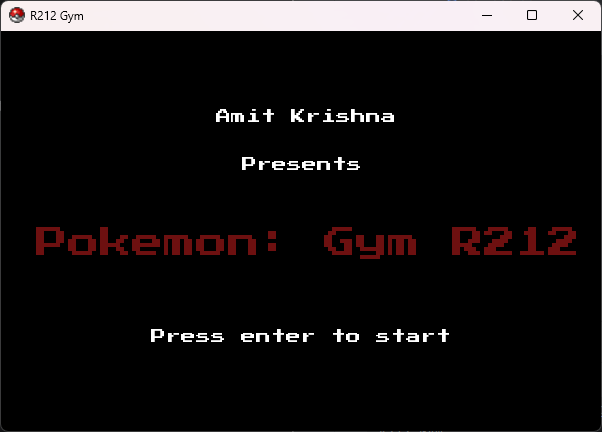

### Info Screen:

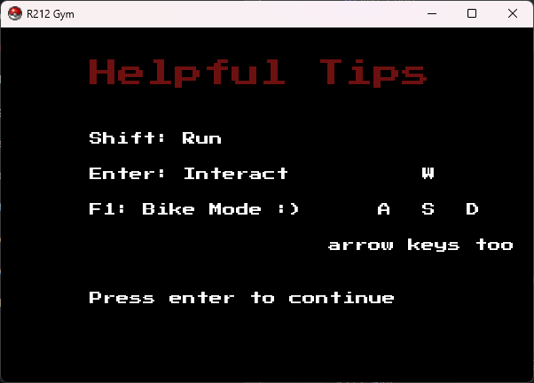

### Map:

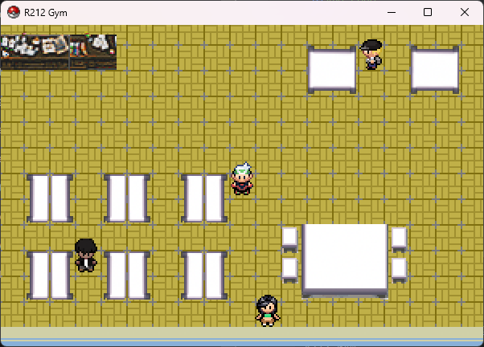

### Dialogue:

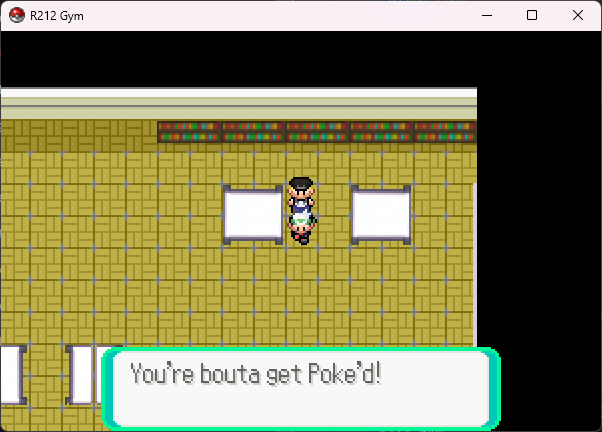
Brady Initial Dialogue
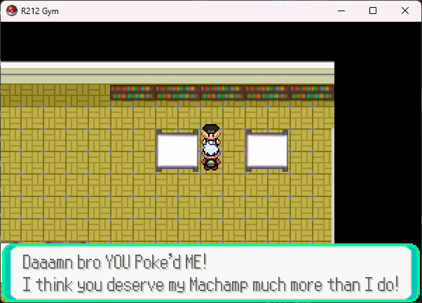
Brady After Defeat Dialogue
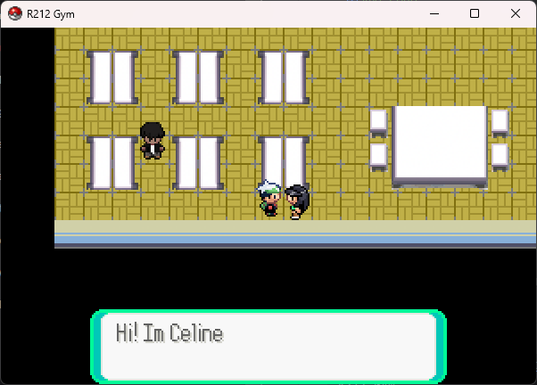
Celine NPC Dialogue
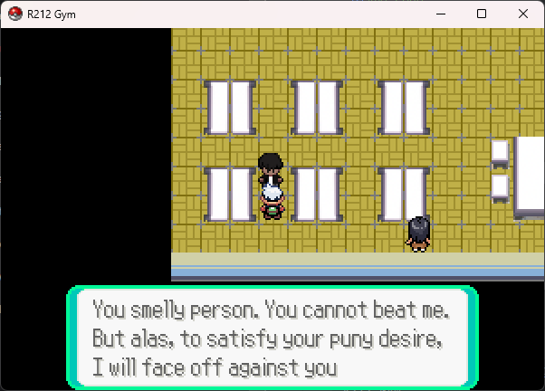
Angad Initial Dialogue
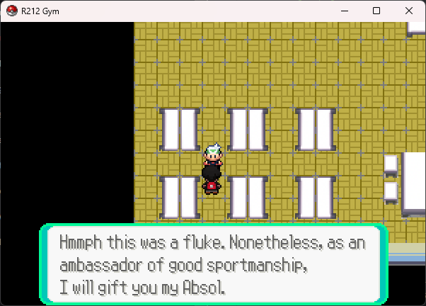
Angad After Defeat Dialogue

### Battle:

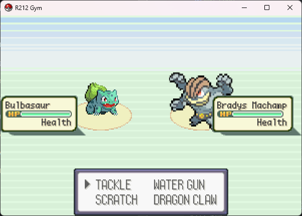
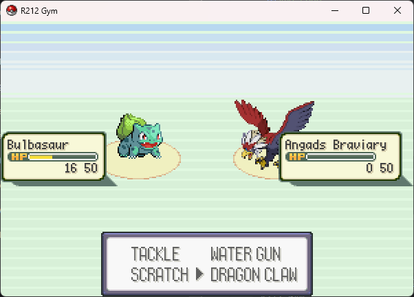
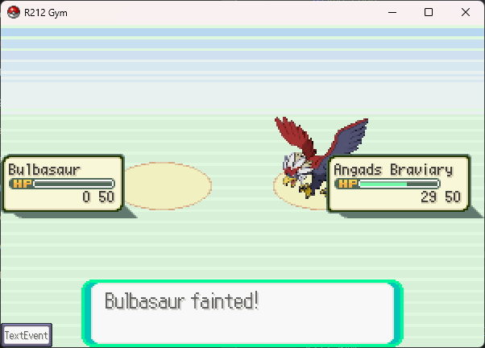
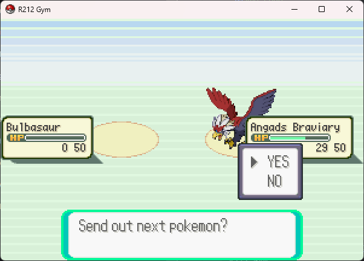
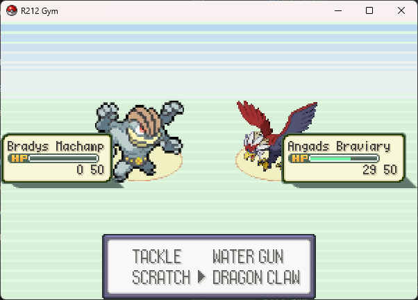
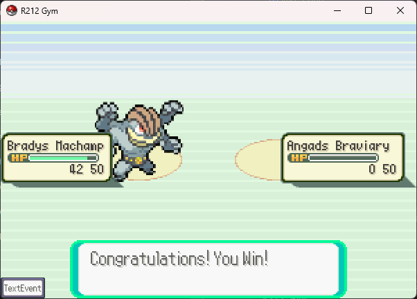

### Kiyoi Battle Scene:
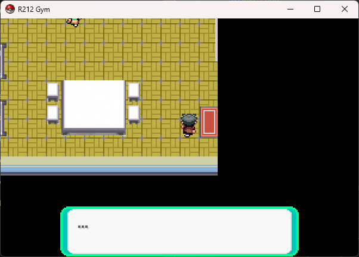
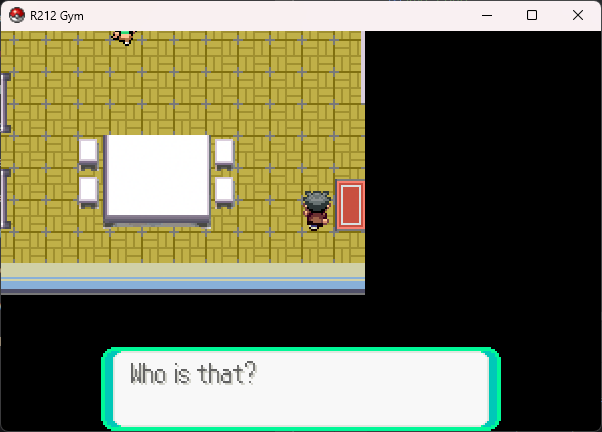
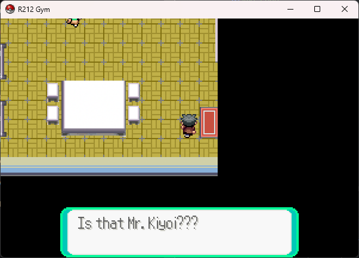
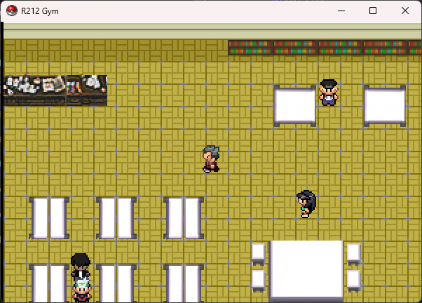
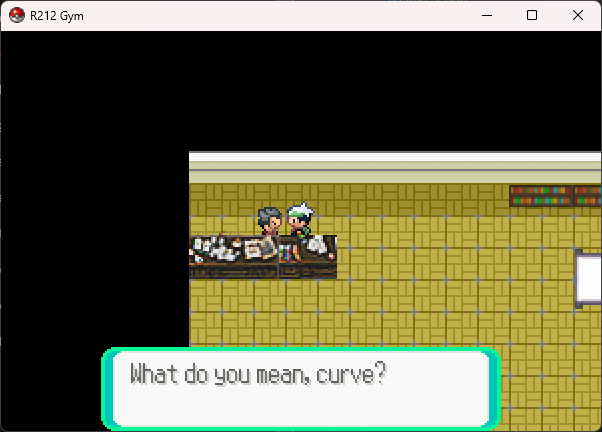
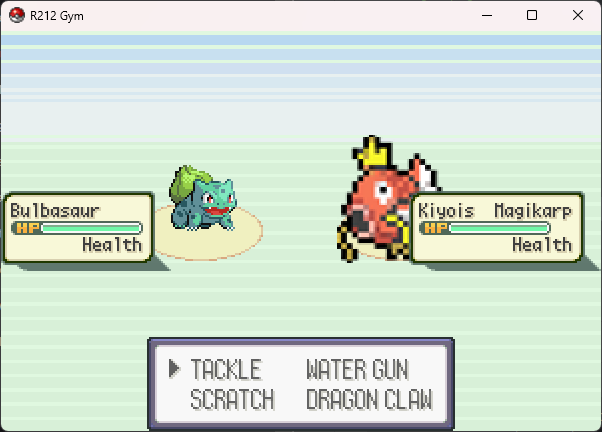
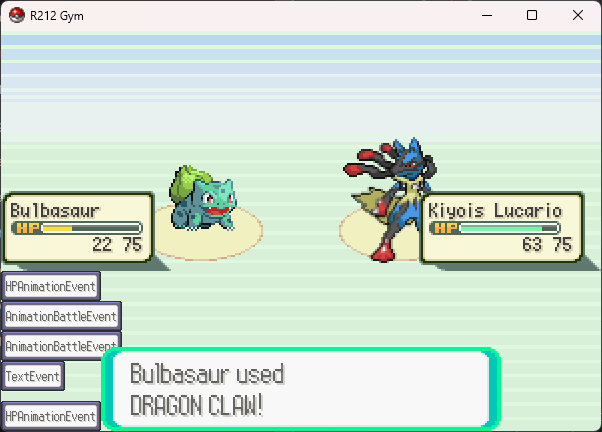
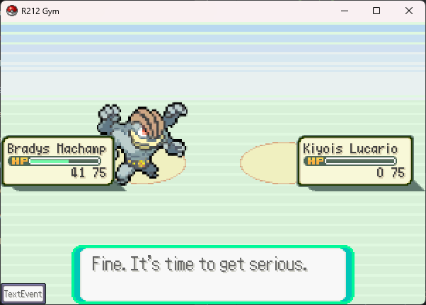
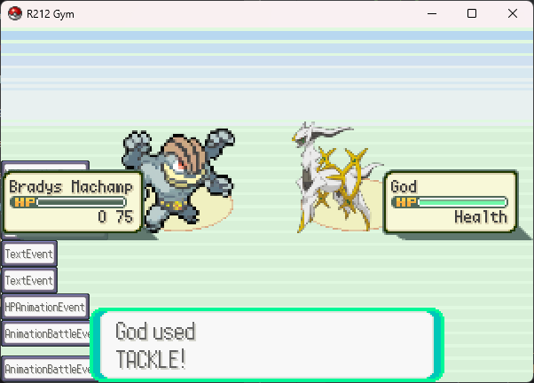
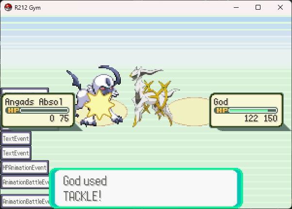
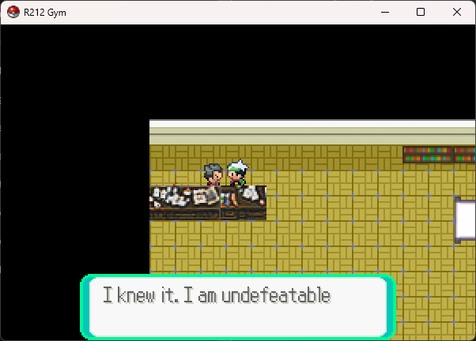